## Design Documentation
**Project Name:** Project Tracker (Organizational project management platform)
**Date:** 02/15/2024 
**Team Name:** Code Crafters

**Introduction:**
    The upcoming paper outlines the design factors for an online platform, including the UI design, functionality requirements for each component and their complexities, and the technology tools used. It includes architectural plans and development process-related procedures.

**System Overview:**
    Project Tracker is a user-friendly web-based platform designed for project management in organizations. It serves as a project tracking and external customer engagement application. The website maintains project details including client information, timelines, and updates. We aim to replace traditional methods like using Excel sheets, as this offers ease of access at fingertips, statistics, and secure authentication.

**Architecture Plan**
    All the database, server and client will be hosted on the same local machine using the listed ports.
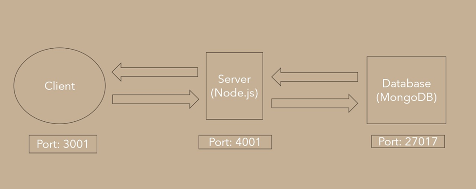

**Architectural Strategies:**
    • EDA (Event-Driven Architecture) – Here all the components are dependent on each other, as the real-time data is always being queried from the Database and the modifications get changed to the Database as the emitting and consuming events. This provides scalability when real-time updates are needed.
    • API Design and Documentation - Create clear and simple APIs to facilitate communication between the system's many components. The API documentation covers everything from endpoint descriptions to request/response formats, error handling, and authentication procedures.

**Components Interface Design:**
    **1.Register Screen:** Contains a form with required fields to register a user to the platform
        D1.1 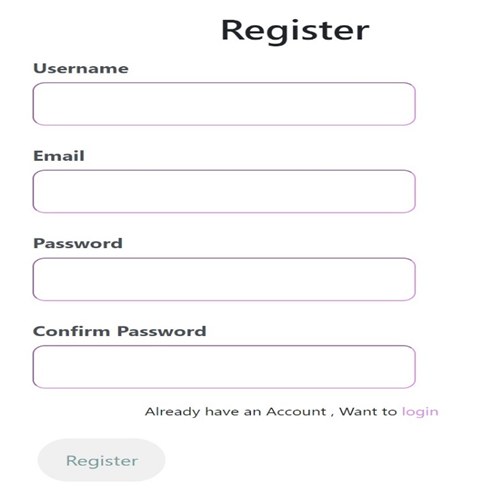
        D1.2 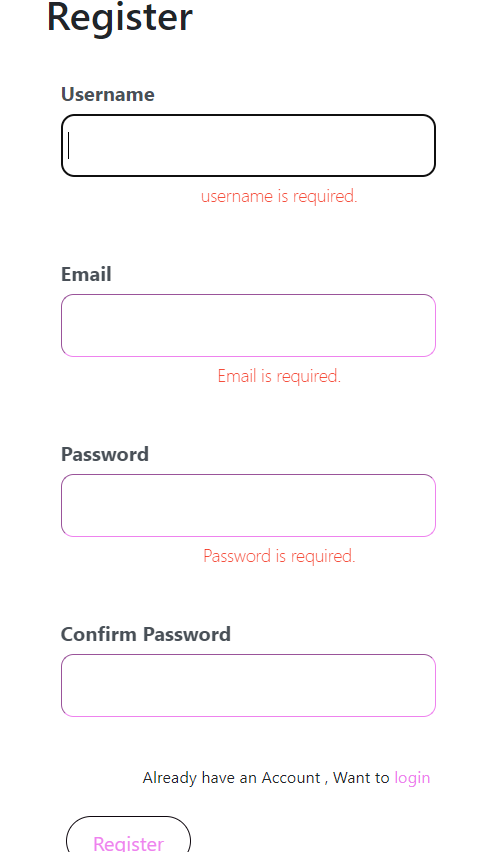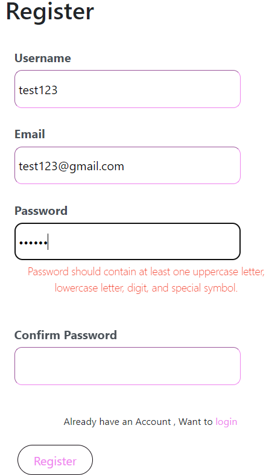 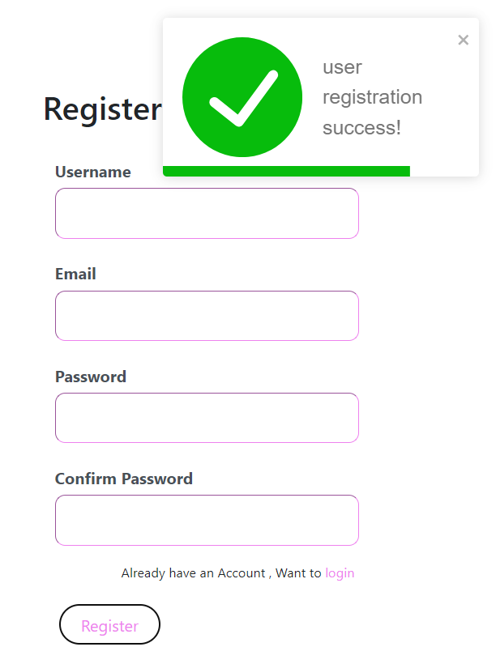 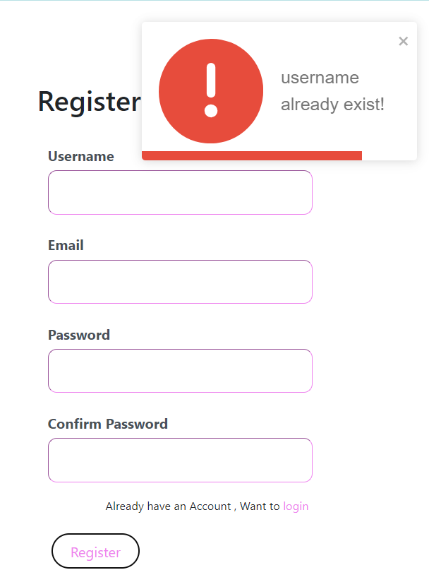
        D1.3 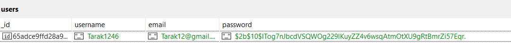
    **2.Login Page:** Contains a form with required fields to login a user into the platform
        D2.1 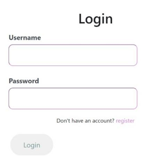
        D2.2 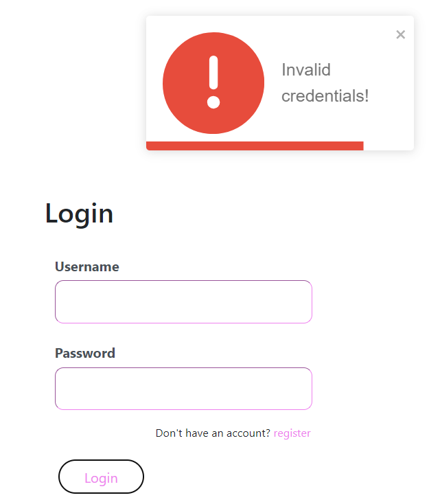
    **3.Dashboard:** Contains real-time data of projects, contracts and employee details
        D3 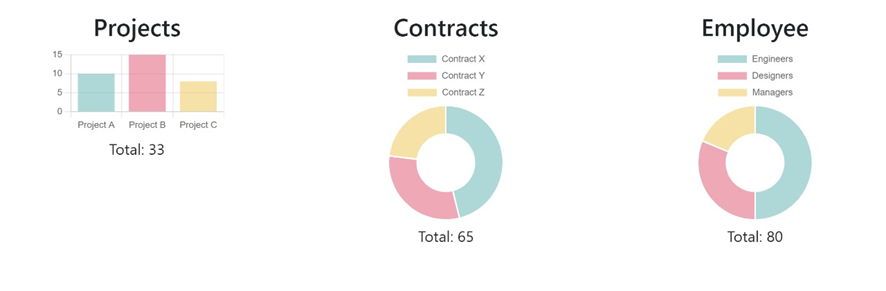
    **4.Projects** Contains the project details as listed above. The data can be changed dynamically, and respective changes will be affected in the database accordingly
        D4 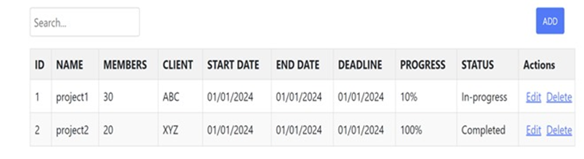
    **5.Contracts** Lists the contracts being worked on by the organization. Data can be modified dynamically, and changes get reflected in the DB
        D5 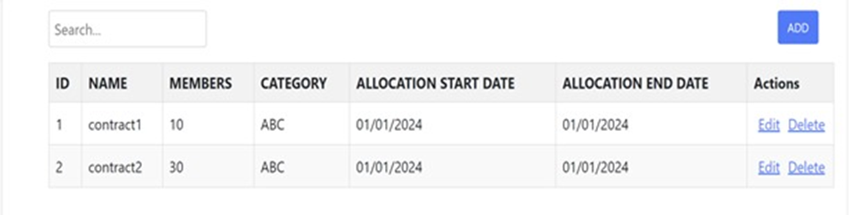
    **6.Employees** Provides the employee details and their roles in the projects. Data can be modified dynamically, and changes get reflected in the DB
        D6 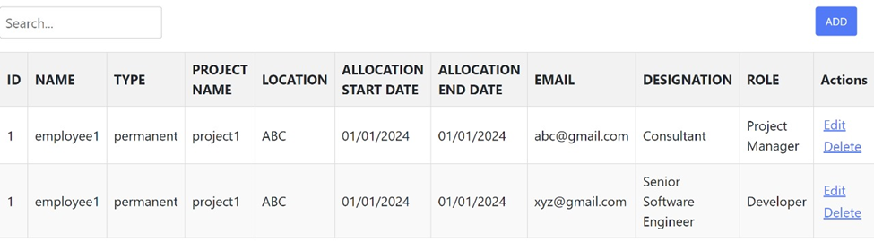
    **7.Settings** This component allows users to view and manage their personal information, edit it, and log out of their account
        D7.1 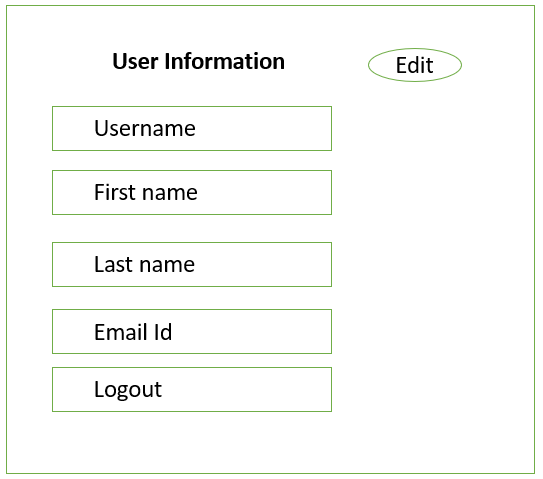
        D7.2 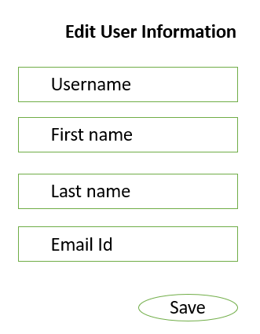

**Team Members:**
1.	S S Eswara Satyanarayana Aneesh Dangeti
2.	Taraka Sai Reddy Seelam
3.	Lakshmi Prasanna Yekkaladevi
4.	Pavan Teja Jukanti
5.	Akshay Reddy Yalla
