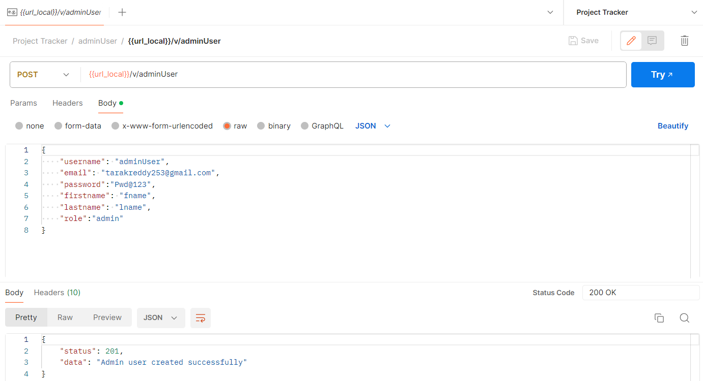
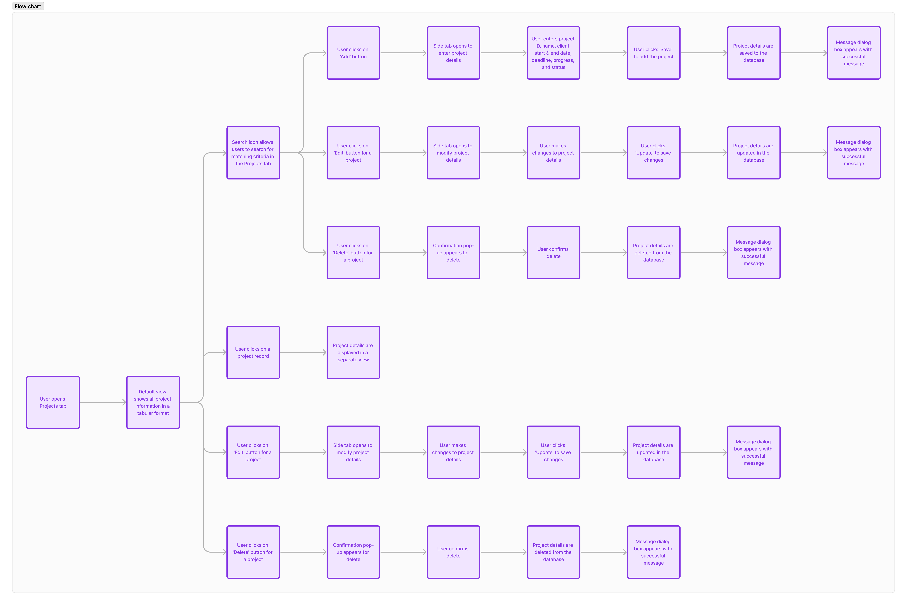
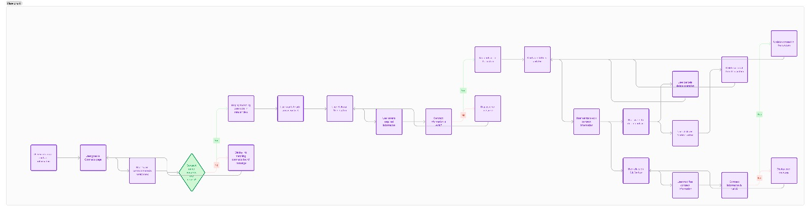
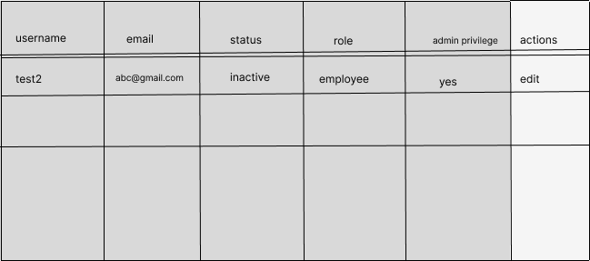

# Design Documentation

* Project Name: Project Tracker (Organizational project management platform)

* Date: 02/15/2024

* Team Name: Code Crafters

* Introduction
  * The upcoming paper outlines the design factors for an online platform, including the UI design, functionality requirements for each component and their complexities, and the technology tools used. It includes architectural plans and development process-related procedures.

* System Overview
  * Project Tracker is a user-friendly web-based platform designed for project management in organizations. It serves as a project tracking and external customer engagement application. The website maintains project details including client information, timelines, and updates. We aim to replace traditional methods like using Excel sheets, as this offers ease of access at fingertips, statistics, and secure authentication.

* Architecture Plan
  * All the database, server and client will be hosted on the same local machine using the listed ports.
  * 

* Architectural Strategies
  * EDA (Event-Driven Architecture)
    * Here all the components are dependent on each other, as the real-time data is always being queried from the Database and the modifications get changed to the Database as the emitting and consuming events. This provides scalability when real-time updates are needed.
  * API Design and Documentation
    * Create clear and simple APIs to facilitate communication between the system's many components. The API documentation covers everything from endpoint descriptions to request/response formats, error handling, and authentication procedures.

## Components Interface Design

* D1. Admin user creation
  * A controlled method for creating admin user through a REST API.
  * Mockup Images
    * D1.1, D1.2
      * 
  * Data Flow Diagram (D1.1,D1.2)
    * 

* D2.Register Screen
  * Contains a form with required fields to register a user to the platform.
  * Mockup Images
    * D2.1 Form Fields
      * 
      * 
    * D2.2 Form Validation
      * 
      * 
      * 
    * D2.3 Security(password stored in hash format)
      * 
  * Data Flow Diagram
    * Data flow diagram for user register component(D2.1,D2.2,D2.3)
    * 

* D3.Login Page
  * Contains a form with required fields to login a user into the platform.
  * Mockup Images
    * D3.1 Form Fields
      * 
      * 
      * 
    * D3.2 Form Validation
      * 
      * 
      * 
  * Data Flow Diagram
    * Data flow diagram for user login component(D3.1,D3.2,D3.3)
    * 

* D4.Dashboard
  * Contains real-time data of projects, contracts, and employee details.
  * Mockup Images
    * D4.1 D4.2 D4.3
      * 
  * Data Flow Diagram
    * Data flow diagram for Dashboard component
    * 

* D5.Projects
  * Contains the project details as listed above. The data can be changed dynamically, and respective changes will be affected in the database accordingly.
  * Mockup Images
    * D5.1 Lists all the project details in below tabular format as per requirement R4.1
      * 
    * D5.2 Edit and add project information.
      * 
      * 
    * D5.3 Lists the search criteria if there are any matches
      * 
    * D5.4 Prompts the user to confirm the delete.
      * 
      * 
    * Data Flow Diagram for the project's component
      * 

* D6.Contracts
  * Lists the contracts being worked on by the organization. Data can be modified dynamically, and changes get reflected in the DB.
  * Mockup Images
    * 
  * Data Flow Diagram for the contracts component
    * 

* D7.Employees
  * Provides the employee details and their roles in the projects. Data can be modified dynamically, and changes get reflected in the DB.
  * Mockup Images
    * 

* D8.Settings
  * This component allows users to view and manage their personal information, edit it, and log out of their account.
  * Mockup Images
    * D8.1 User Information
      * 
    * D8.2 Edit User Settings
      * 
      * 
  * Data Flow Diagram
    * Data flow diagram for user settings component(D8.1,D8.2).
    * 

* D9.Users
  * This component will display all the registered users in table format and provides an option to modify the user.
  * Mockup Images
    * D9.1 List users
      * 
    * D9.2 Edit user
      * 
  * Data Flow Diagram
    * Data flow diagram for users component(D9.1,D9.2).
    * 

* Team Members
        1. S S Eswara Satyanarayana Aneesh Dangeti
        2. Taraka Sai Reddy Seelam
        3. Lakshmi Prasanna Yekkaladevi
        4. Pavan Teja Jukanti
        5. Akshay Reddy Yalla
