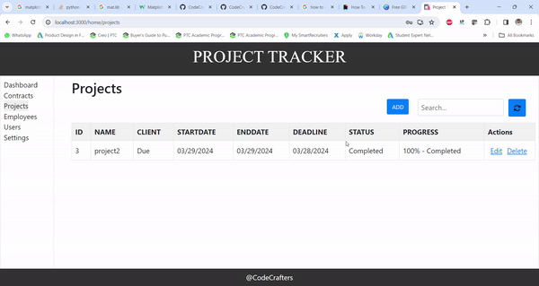
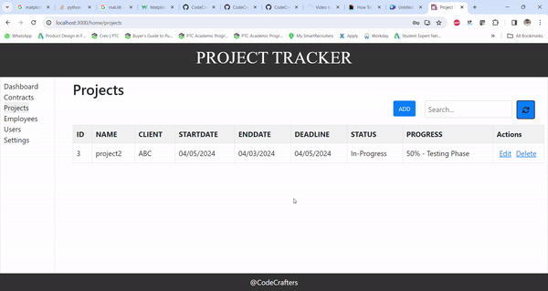

# Minimum Viable Product (MVP) Document

## Project Overview

* Project Title: Project Tracker 

* Project Description: Project Tracker is a user-friendly role-based web application designed for project management in organizations. This application facilitating project, contract, and employee management. Admins and managers can add, edit, and delete projects, contracts, and employees, while approving user roles. The application tracks project details (ID, name, members, etc.), contract details (ID, name, category, etc.), and employee details (ID, name, type, project, etc.). All data will be visualized using charts. Our aim is to replace traditional methods like using Excel sheets, as this offers ease of access at fingertips, statistics, and secure authentication.

The intellectual merit of this is to provide ourselves with a thorough understanding of the software development process, as everyone engages in both development and testing roles. This approach ensures continuous improvement and adaptability, essential for timely project deployment. The broader impact of this method builds us ready for real-world IT challenges, fostering skills in agile methodologies and collaborative problem-solving.

* Project Team: 
1.Taraka Sai Reddy Seelam
2.Yekkaladevi Lakshmi Prasanna
3.S S Eswara Satyanarayana Aneesh Dangeti
4.Pavan Teja Jukanti
5.Akshay Reddy Yalla

* Timeline:
Start Date:  JAN 29
End Date: Expected end date of the MVP development - MAR 22

* Snapshots:

* Admin user creation

*Admin User creation and Activation

* Login page

* Register page

* Dashboard page

* Contracts

**Projects page**
Below is the projects tab page that will look like when viewed. It contains existing project information.

* R5/R5.1:

* Below image shows the projects information saved in the database in the backend.

* R5.2 - Form Fields(Edit/Add actions):
 

* Below GIF shows how the existing project can be edited.

* Below GIF shows how to add a new project.

* R5.3 - Below GIF shows the search of records.

* R5.4 - Below GIF shows how to delete a project.

**Employees page**

* Users page

* Settings page

