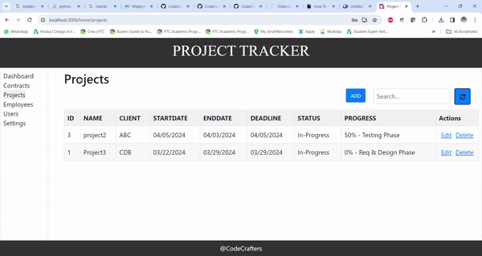

# Minimum Viable Product (MVP) Document

## Project Overview

**Project Title:** Project Tracker

**Project Description:** Project Tracker is a user-friendly role-based web application designed for project management in organizations. This application facilitating project, contract, and employee management. Admins and managers can add, edit, and delete projects, contracts, and employees, while approving user roles. The application tracks project details (ID, name, members, etc.), contract details (ID, name, category, etc.), and employee details (ID, name, type, project, etc.). All data will be visualized using charts. Our aim is to replace traditional methods like using Excel sheets, as this offers ease of access at fingertips, statistics, and secure authentication.

The intellectual merit of this is to provide ourselves with a thorough understanding of the software development process, as everyone engages in both development and testing roles. This approach ensures continuous improvement and adaptability, essential for timely project deployment. The broader impact of this method builds us ready for real-world IT challenges, fostering skills in agile methodologies and collaborative problem-solving.

**Project Team:**

1. Taraka Sai Reddy Seelam
2. Yekkaladevi Lakshmi Prasanna
3. S S Eswara Satyanarayana Aneesh Dangeti
4. Pavan Teja Jukanti
5. Akshay Reddy Yalla

**Timeline:**

* Start Date:  JAN 29
* End Date: Expected end date of the MVP development - MAR 22

### Snapshots

* Admin user creation
  * Below snapshot and video represents an admin user creation through a REST API using postman
  * R1/R1.1/R1.2 : REST API with valid request payload
    * 
    * 

* Register page
  * R2/R2.1/R2.2/R2.3 : Contains a form with required fields to register a user to the platform
  * Below snapshot and video represents a user registration. All the users who want to access the platform features can register here
    * 
    * 

* Login page
  * R3/R3.1/R3.2 : Contains a form with required fields to login a user into the platform.
  * Below snapshot and video represents a user login. All the registered and approved users can login
    * 
    * 

* Dashboard page
  * R4/R4.1/R4.2/R4.3 : Dashboard module aims to provide users with a graphical representation of key metrics related to employees, contractors, and projects within the organization
  * Below snapshot represents graphical representation of key metrics related to employees,contractors, and projects within the organization
    * 
    * 

* Projects page
  * Below is the projects tab page that will look like when viewed. It contains existing project information.
  * R5/R5.1:
    * 
    * Below image shows the projects information saved in the database in the backend.
      * 
  * R5.2 - Form Fields(Edit/Add actions):
    * 
    * 
  * Below GIF shows how the existing project can be edited.
    * 
  * Below GIF shows how to add a new project.
    * .gif>)
  * R5.3 - Below GIF shows the search of records.
    * 
  * R5.4 - Below GIF shows how to delete a project.
    * 

* Contracts page
  * R6/R6.1/R6.2/R6.3/R6.4/R6.5/R6.6 : Below is the contracts tab page that will look like when viewed. It contains existing contract information
  * Below snapshot represents contracts information of an organization
    * 
  * Adding a contract
    * 

* Employees page
  * R7/R7.1/R7.2/R7.3/R7.4/R7.5/R7.6 : Below is the employees tab page that will look like when viewed. It contains existing employee information
  * Below snapshot represents employees information of an organization
    * 
    * 

* Settings page
  * R8/R8.1/R8.2 : Contains logged in user information, an edit option and logout option.
  * Below snapshot and video represents logged in user information and logout feature
    * 
    * 

* Users page
  * R9/R9.1/R9.2 : Contains all registered users information in table format and an edit option to update the status and admin privileges by admin users only.
  * Below snapshot and video represents all users information of an organization
    * 
    * 

