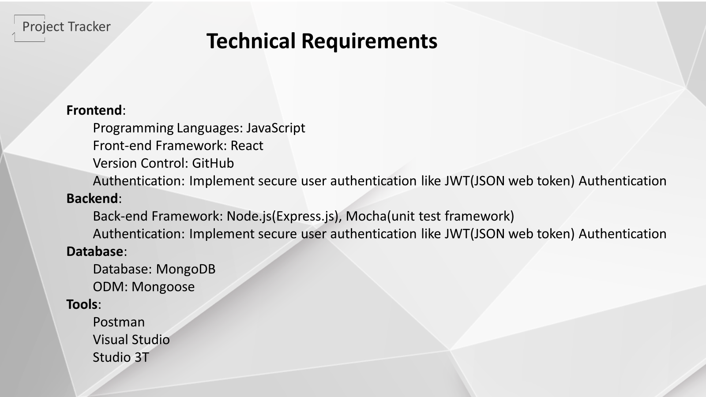
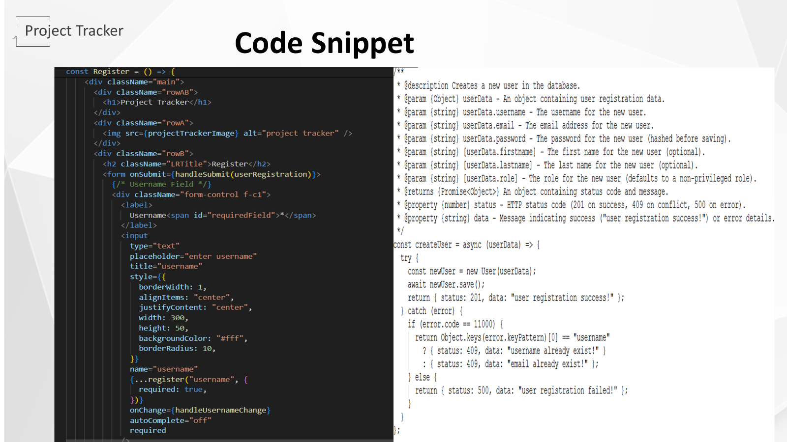

# Project Tracker - Team CodeCrafters

# Slide 1 - Team Names

* Project Name and team members name

----------------------

# Slide 2 - Roles

* Describes the roles taken by the team members in the development of the project tracker web platform.

----------------------

# Slide 5 - Technical Requirements

* Frontend:
* Programming Languages: JavaScript
* Front-end Framework: React
* Version Control: GitHub
* Authentication: Implement secure user authentication like JWT(JSON web token) Authentication
* Backend:
* Back-end Framework: Node.js(Express.js), Mocha(unit test framework)
* Authentication: Implement secure user authentication like JWT(JSON web token) Authentication
* Database:
* Database: MongoDB
* ODM: Mongoose
* Tools:
* Postman
* Visual Studio
* Studio 3T

----------------------

# Slide 6 - Agile Methodology

* The project is developed using the agile methodology which involves the continuous integration and continuous development of the project.

----------------------

# Slide 7 - Architecture

------------------------

# Slide 8- Components

------------------------

# Slide 9 - User Registration

* This slide gives the introduction, requirements and user story of the user registration component in the project tracker.

* Introduction
  * To access the application, an employee should register with their details.
  * Registered user is in active mode.
  * Only admin users/admin privilege users can activate the registered users.

* Requirements
  * A register form will provide with following fields.
    * Username: Unique, no suggestions, error for duplicates.
    * Email: Valid format, case-insensitive, unique, error for duplicates.
    * Password: Min 8 characters, enforce complexity (uppercase, lowercase, digit, special symbol), masked input, error for invalid passwords, no suggestions.
    * Confirm Password: Must match password, error for mismatch.
    * Login Link: Navigate to the login page and Clear the login form upon click.
    * Register Button: Validate payload and show proper registration status.

* User story
  * As an employee, I want to sign up for a new user account on the platform so that I can access its features and functionalities. I will need to provide a distinct username, email address, and password

----------------------

# Slide 10 - User Registration UI

* This slide gives user interface of the user registration component in the project tracker.

----------------------

# Slide 11 - User Registration Code Snippet

* This slide gives react(front-end) code and node.js(back-end) code snippets of the user registration component in the project tracker.

----------------------

# Slide 12 - User Registration API's

* This slide gives list of api's used for the user registration component in the project tracker.

  * 1. Get registered users
    * Endpoint: /v/getUsers
    * Method: GET
  * 2. User Register
    * Endpoint: /v/register
    * Method: POST
    * Request payload : {"username": "Test", "email": "<test@gmail.com>", “password”: “Test@1234”, "confirm_password": "Test@1234"}

----------------------

# Slide 13 - User Registration Evaluation Criteria

* This slide gives evaulation criteria of the user registration component in the project tracker.
* EC : Secure user registration form with validation unique username, email, and strong password with confirmation, clear error messages, and successful registration/failure toast notification.

----------------------

# Slide 14 - Admin User Creation

* This slide gives introduction, requirements, and user story of the admin user creation functionality in the project tracker.

* Introduction : In the project tracker web application, the admin user holds the highest level of authority and responsibility.
* Privileges
  * Access to all features and functionalities of the project tracker web application.
  * Authority to create and modify user accounts.
  * Oversight of project/employee data, including creation, editing, and deleting.
* Requirements
  * REST API to create an admin user for the application
* User Story
  * As a system administrator, I want to create a new admin user through a secure API endpoint, providing their username, email, password, and optional name information, so that I can manage system access and assign administrative privileges
  
  

----------------------

# Slide 15 - Admin User API Format

* This slide gives format of the admin user API in the project tracker.

----------------------

# Slide 16 - Admin User Code Snippet

* This slide gives react(front-end) code and node.js(back-end) code snippets of the admin user creation in the project tracker.

----------------------

# Slide 17 - Admin User Evaluation Criteria

* This slide gives evaulation criteria of the admin user creation in the project tracker.
* EC : Functionally creates admin via POST request with validated unique username, email, and strong password.

----------------------

# Slide 18 - User Login

* This slide gives the introduction, requirements and user story of the user login component in the project tracker.

* Introduction
  * Active registered users can log in to the application to access the features based on the privileges.
  * When the user tries to log in, the data gets verified with the backend database and gets authenticated.

* Requirements
  * A login form will provide with following fields.
    * Username: Text Field (mandatory), no suggestions.
    * Password: Text Field (mandatory), Minimum 8 characters, Enforce complexity (uppercase, lowercase, digit, special symbol).
    * Register Link: Navigate to the register form and clear the login form upon clicking.
    * Login Button: Submits form data.

* User story
  * As a registered user, I want to log in to the application using my username and password so that I can access its features and functionalities

----------------------

# Slide 19 - User Login UI

* This slide gives user interface of the user login component in the project tracker.

----------------------

# Slide 20 - User Login Code Snippet

* This slide gives react(front-end) code and node.js(back-end) code snippets of the user login component in the project tracker.

----------------------

# Slide 21 - User Login API's

* This slide gives list of api's used for the user login component in the project tracker.

  * 1. Get registered users
    * Endpoint: /v/getUsers
    * Method: GET
  * 2. User Login
    * Endpoint: /v1/login
    * Method: POST
    * Request payload : {"username":"adminUser","password":"Pwd@1234"}

----------------------

# Slide 22 - User Login Evaluation Criteria

* This slide gives evaulation criteria of the user login component in the project tracker.
* EC : Secure user login form with validate username and strong password, masked input, and clear error messages. Form clears after submission.

----------------------

# Slide 23 - Users

* This slide gives the introduction, requirements and user story of the users component in the project tracker.

* Introduction
  * The user page will allow to display user’s privileges and also allow admin privilege users to update privileges except admin role users.
  * All the changes act like a query to the database and the tables get modified accordingly.

* Requirements
  * A table displays all registered users with:
    * Username, Email, Status, Role, Admin Privilege
  * Edit Option: Only admins can edit users. Clicking "Edit" opens the edit form for the selected user.
  * Edit User Form:
    * Pre-populated with existing user data: Username (read-only), Email, Status (editable dropdown)
    Role (editable dropdown), Admin Privilege (editable checkbox)
    * Allows admins to modify: User Status, User Role, Admin Privilege
  
* User story
  * As an admin privilege user, I would like to examine user information, including username, email, status, role, and admin privilege, and also update status and privilege

----------------------

# Slide 24 - Users Tab UI

* This slide gives user interface of the users component in the project tracker.

----------------------

# Slide 25 - User Login Code Snippet

* This slide gives react(front-end) code and node.js(back-end) code snippets of the users component in the project tracker.

----------------------

# Slide 26 - Users Tab API's

* This slide gives list of api's used for the users component in the project tracker.

  * 1. Get registered users
    * Endpoint: /v/getUsers
    * Method: GET
    * Authorization: JSON Web Token
  * 2. Update user information
    * Endpoint: /v2/updateUserPrivileges
    * Method: PUT
    * Authorization: JSON Web Token
    * Request payload : {"username":"tarak123","email":"taraksai@gmail.com","role":"employee","status":"active","admin privilege":"true","adminPrivilege":"true"}

----------------------

# Slide 27 - Users Tab Evaluation Criteria

* This slide gives evaulation criteria of the users component in the project tracker.
* EC : Admin-only user management page listing all users in a table with username, email, status, role, and admin privilege. The edit option allows admins to edit user data (status, role, and potential privilege) within a dedicated form

----------------------

# Slide 33 - Project Component

* This slide gives the introduction about the projects tab component in the project tracker and a brief mention of the user stories for the development of this component.

----------------------

# Slide 34 - Project Component Requirements

* The below slide describes the brief mention of requirements followed to achieve the required functionality of the projects component development. In detailed requirements are listed under R5 in requirements document.

-----------------------

# Slide 35 - Project Tab UI

* Represents how the user interface of the project component looks like.

-----------------------

# Slide 36 - Projects Component client side Code Snippet

* The codes written for the client(front end), the project.js and project.css(styling) code which is basically the main code of the front end. Several other code files required for the functionality are present in the repository.

------------------------

# Slide 37 - DataBase Schema - Projects

* This slide shows the projectSchema.js which is a backend code needed to create a schema in database for project records. The images shows the project record in the MongoDB database.

------------------------

# Slide 38 - Projects API

* The sample API explains how the API call triggers the database query with the passed input. The sample shows the addProject functionality API, upon API call, the record is getting added into the database.
* The below API call shows the API call being sent successfully and the same record being visible in the front end platform.

-----------------------

# Slide 39 - Project Tab

* This slide demonstrates the complete functionality of the projects component in a video format.
* The validations and duplications and conditions needed for each field in the table and the item in the forms are getting rules from the code directly and the authorizations and token usage.
* New project Addition.
* Edit existing project information.
* Delete the existing projects.
* View of the projects.
* Dynamic update of members count based on the new employee allotment to the project - This member count queries all the employees records and brings the count one by one to the projects database, and then the field gets updated and saved into the projects database.

--------------------------

# Slide 46 - Employee Component

* Purpose of the Employees component.
* Ability to modify, delete, and create employee details.
* Immediate updates to the database.
* Data synchronization for real-time updates.
 

--------------------------

# Slide 47 - Employee Component user story

* As a user, I want to see a list of all employees in a table format.
* As a user, I want to search for employees by entering their names in a search box.
* As a user, I want to add a new employee to the system.
* As a user, I want to edit the details of an existing employee.
* As a user, I want to delete an existing employee.
* As a user, I want the employee table to update in real-time after edit or delete operations.

--------------------------

# Slide 48 - Employee Component UI

--------------------------

# Slide 49 - Employee Component UI

--------------------------

# Slide 50 - Code Snippet

--------------------------

# Slide 51 - Evaluation Criteria

--------------------------

# Slide 52 - User Settings

* This slide gives the introduction, and requirements of the user settings component in the project tracker.

* Introduction
  * The user settings page will allow users to see/update personal information. All the changes act as a query to the database and the tables get modified accordingly

* Requirements
  * Profile Display: Shows the user's current information
    * Username (read-only)
    * Email Address
    * First Name
    * Last Name
  * Edit Profile:
    * Edit Button: Triggers a form to edit user data.
    * Edit Form:
      * Pre-populated with existing data for:
      * Email Address (editable)
      * First Name (editable)
      * Last Name (editable)
      * Save Button: Submits changes and updates displayed information.
      * Logout: Provides a safe way for users to log out of the platform.

----------------------

# Slide 53 - Users Settings User Story and UI

* This slide gives user story and user interface of the user settings component in the project tracker.
* User story
  * As a registered user, I want to view my current profile information, including username, email address, first name, and last name, so that I can easily see and manage my account details.
  
  * As a registered user, I want to edit my profile information, including email address, first name, and last name, within certain bounds, so that I can keep my information accurate and up-to-date.

----------------------

# Slide 54 - User Settings Tab Code Snippet

* This slide gives react(front-end) code and node.js(back-end) code snippets of the user settings component in the project tracker.

----------------------

# Slide 55 - User SettingsTab API's

* This slide gives list of api's used for the user settings component in the project tracker.

  * 1. Get logged-in user info
    * Endpoint: /v2/getLoggedinUserData/{username}
    * Method: GET
    * Authorization: JSON Web Token
  * 2. Update user data
    * Endpoint: /v2/updateUserData
    * Method: POST
    * Authorization: JSON Web Token
    * Request payload : {"username":"adminUser","email":"test1@gmail.com","firstname":"firstname","lastname":"lastnam"}

----------------------

# Slide 56 - Users Settings Tab Evaluation Criteria

* This slide gives evaulation criteria of the user settings component in the project tracker.
* EC : User settings page showing current username, email, first name, and last name. Offers an "Edit" button to update editable information (first name, last name, and email format) with validation and error messages. Allows saving changes, undoing edits, and secure logout.

----------------------

# Slide 57 - Unit Test Cases

* This slide gives unit test cases gif for the apis used in the project tracker application.

# Slide 58 - What have we learned?

* Software Development Process.
* Exposed to GitHub.
* Team collaboration.
* Agile Methodology.

# Slide 59 - Questions?

---------------------------

# Slide 60 - Thank you

---------------------------

Contributors:

* Group Member 1: S S Eswara Satyanarayana Aneesh Dangeti (Projects Component).
* Group Member 2: Taraka Sai Reddy Seelam (User Register, Admin User Creation, User Login,  Users and Settings Components).
* Group Member 3: Akshay Reddy Yalla (Employees Component).
